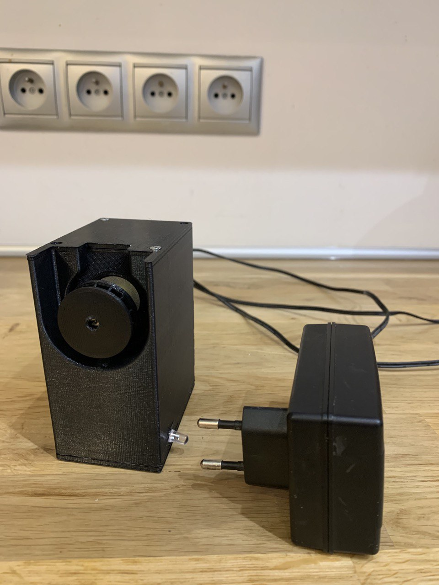
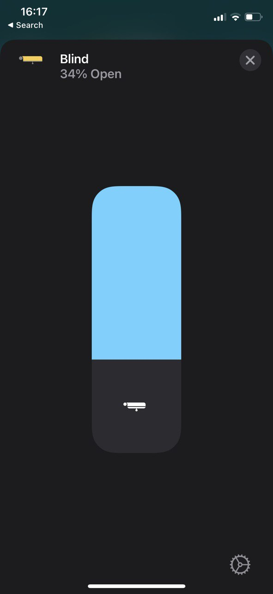

# ESP8266 Homekit - Roller Blinds

## Documentation

This is first version of documentation. Feel free to text me so I'll improve it over time.

## Base

This project is inspired by this article: https://www.candco.com.au/2020/04/18/diy-smart-blinds-v3/ . All wiring diagrams, hardware and 3D models can be found there.

## Requirements:

There is list of things that you'll need and what I used.

- 3D printer `Ender 3 Pro` (I've used 100% infill in every element to make sure it's strong)
- ESP8266 chip `NodeMCU v3`
- Stepper driver controller `A4988` (Make sure you set proper current to avoid motor overheat etc.)
- Stepper motor `JK42HS40-0404` (Almost any NEMA17 stepper motor will be fine, but make sure it has enough holding moment)
- 12V power supply
- Step-down converter `D24V3F5`
- Some wires

## Software

Featues:
- Homekit integration
- Calibration (top/bottom position)
- Buttons
- LED
- Current position and target position is saved after each move

## Instruction

### Setup

- Make sure that device is connected to roller blind chain properly
- Connect to power supply
- Search for WiFi network `Roller Blind Configuration` and connect with it
- Open browser. Config page should appear automatically
- Select your home WiFI and provide proper password
- Save it
- Your device should be discoverable by Homekit now, when you'll try to add it. Code is `111-11-111`

### Calibration

- Your device will turn into calibration mode if it was not calibrated ever before
- If you want to go manually into calibration mode, hold button for 5 seconds
- When LED blinks - you're in calibration mode
- Hold UP button and wait until your roller blind will reach top position
- Press main button - LED should stop blinking for a second
- Hold DOWN button and wait until your roller blind will each bottom position
- Press main button - now your device knows how long is your blind and is calibrated

### Manual control

Use UP/DOWN buttons to move roller blind. Once clicked roller blind will try to each TOP/BOTTOM position. You can stop it by pressing main button.

### Factory reset

Hold main button for 10 seconds - until LED stops blinking. Wait about a minute until LED starts to be enabled again. Then disconnect and connect again your power supply.

## Video

 

 

###### HomeKit Accessory Protocol (HAP) is Apple’s proprietary protocol that enables third-party accessories in the home (e.g., lights, thermostats and door locks) and Apple products to communicate with each other. HAP supports two transports, IP and Bluetooth LE. The information provided in the HomeKit Accessory Protocol Specification (Non-Commercial Version) describes how to implement HAP in an accessory that you create for non-commercial use and that will not be distributed or sold.

###### The HomeKit Accessory Protocol Specification (Non-Commercial Version) can be downloaded from the [HomeKit Apple Developer page.](https://developer.apple.com/homekit/)

###### Copyright © 2019 Apple Inc. All rights reserved.

